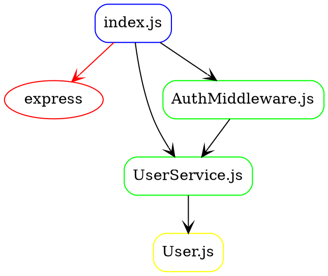
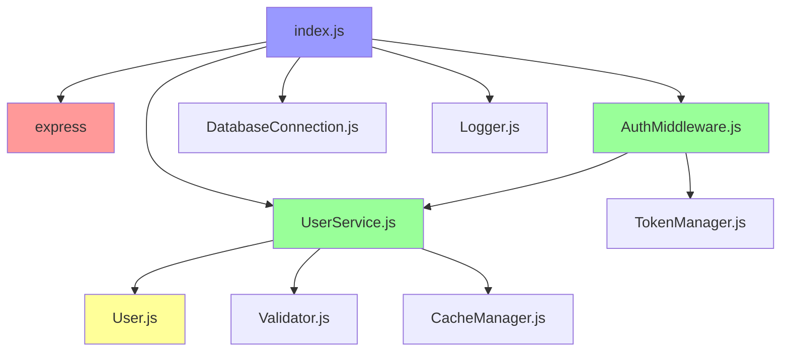

# JavaScript Project Analysis Example

This document shows the expected output for analyzing the JavaScript test project in `tests/js/`.

## Project Structure

```
tests/js/
├── package.json
├── index.js (main entry point)
├── services/
│   └── UserService.js
├── models/
│   └── User.js
├── middleware/
│   └── AuthMiddleware.js
├── db/
├── utils/
└── ...
```

## Module-Level Dependencies

### Terminal Output Format
```
[MODULE] express -> express (external)
[MODULE] UserService -> ./services/UserService.js
[MODULE] AuthMiddleware -> ./middleware/AuthMiddleware.js
[MODULE] DatabaseConnection -> ./db/Connection.js
[MODULE] Logger -> ./utils/Logger.js
```

### JSON Output Format
```json
{
  "dependencies": [
    {
      "layer": "MODULE",
      "connection_type": "IMPORT",
      "module_name": "express",
      "target": "express",
      "file_path": "tests/js/index.js",
      "external": true
    },
    {
      "layer": "MODULE", 
      "connection_type": "IMPORT",
      "module_name": "UserService",
      "target": "./services/UserService.js",
      "file_path": "tests/js/index.js",
      "external": false
    }
  ],
  "metadata": {
    "generated_at": "2024-08-31T06:45:00Z",
    "total_dependencies": 5,
    "format_version": "1.0"
  }
}
```

## Structure-Level Dependencies

### Classes and Objects
```
[STRUCT] UserService
├─ getAllUsers() -> Promise<User[]>
├─ getUserById(id) -> Promise<User>
├─ createUser(userData) -> Promise<User>
├─ updateUser(id, updateData) -> Promise<User>
└─ deleteUser(id) -> Promise<boolean>

[STRUCT] AuthMiddleware
├─ authenticate() -> middleware function
├─ requireRole(role) -> middleware function
└─ requirePermission(permission) -> middleware function

[STRUCT] User
├─ constructor(userData)
├─ isAdmin() -> boolean
├─ isModerator() -> boolean
└─ hasPermission(permission) -> boolean
```

## Method-Level Dependencies

Shows function call relationships:
```
index.js:app.get('/users') -> userService.getAllUsers()
index.js:app.post('/users') -> userService.createUser()
UserService.createUser() -> User.constructor()
UserService.createUser() -> Validator.validateUserData()
AuthMiddleware.authenticate() -> TokenManager.verify()
AuthMiddleware.authenticate() -> UserService.getUserById()
```

## GraphViz Output



## Mermaid Diagram



## Analysis Statistics

- **Total Files**: 8
- **Module Dependencies**: 12
- **Structure Dependencies**: 6
- **Method Dependencies**: 25
- **External Dependencies**: 2 (express, lodash)
- **Circular Dependencies**: 0

## Filter Examples

### Only Module Level
```bash
./crawler --layer module tests/js/
```

### Only Structure Level  
```bash
./crawler --layer struct tests/js/
```

### External Dependencies Only
```bash
./crawler --external-only tests/js/
```

### Exclude Node Modules
```bash
./crawler --exclude "node_modules" tests/js/
```