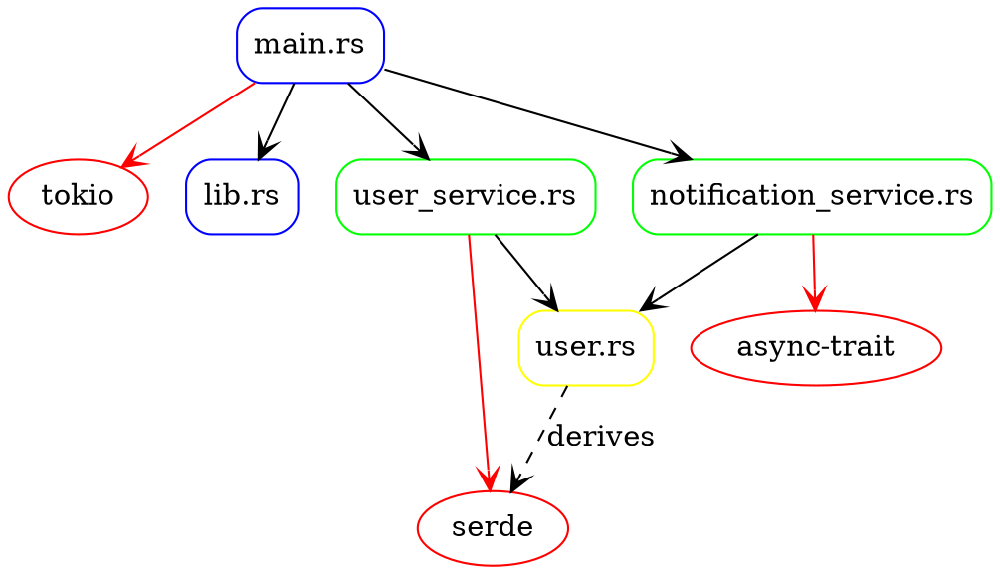
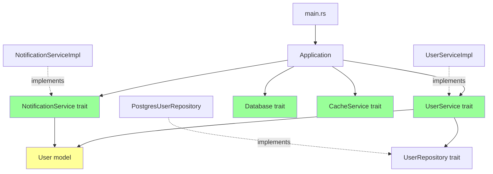

# Rust Project Analysis Example

This document shows the expected output for analyzing the Rust test project in `tests/rust/`.

## Project Structure

```
tests/rust/
├── Cargo.toml
├── src/
│   ├── main.rs
│   ├── lib.rs
│   ├── models/
│   │   ├── mod.rs
│   │   └── user.rs
│   ├── services/
│   │   ├── mod.rs
│   │   ├── user_service.rs
│   │   └── notification_service.rs
│   └── utils/
│       ├── mod.rs
│       └── logger.rs
```

## Module-Level Dependencies

### Use Statements Analysis
```
[MODULE] tokio -> tokio (external crate)
[MODULE] serde -> serde (external crate) 
[MODULE] UserService -> crate::services::UserService
[MODULE] NotificationService -> crate::services::NotificationService
[MODULE] User -> crate::models::User
[MODULE] Logger -> crate::utils::Logger
[MODULE] std::sync::Arc -> std::sync::Arc (standard library)
```

### Cargo Dependencies
```
[MODULE] tokio = "1.0" (external, runtime)
[MODULE] serde = "1.0" (external, serialization)
[MODULE] async-trait = "0.1" (external, async traits)
[MODULE] thiserror = "1.0" (external, error handling)
[MODULE] uuid = "1.0" (external, UUID generation)
[MODULE] chrono = "0.4" (external, date/time)
[MODULE] tracing = "0.1" (external, logging)
```

## Structure-Level Dependencies

### Traits and Implementations
```
[STRUCT] User
├─ UserRole (enum)
├─ UserStatus (enum) 
├─ UserPreferences (struct)
└─ impl User
    ├─ new() -> Self
    ├─ full_name() -> String
    ├─ is_admin() -> bool
    ├─ can_authenticate() -> bool
    └─ has_permission(&self, permission: &str) -> bool

[STRUCT] UserService (trait)
├─ create_user(&self, request: CreateUserRequest) -> Result<User>
├─ get_user_by_id(&self, id: Uuid) -> Result<Option<User>>
├─ get_active_users(&self) -> Result<Vec<User>>
└─ send_bulk_notification(&self, ids: Vec<u64>, message: &str) -> Result<()>

[STRUCT] NotificationService (trait)
├─ send_welcome_notification(&self, user: &User) -> Result<()>
├─ send_admin_welcome_notification(&self, user: &User) -> Result<()>
└─ shutdown(&self) -> Result<()>
```

## Method-Level Dependencies

### Function Calls and Dependencies
```
main() -> Application::new()
main() -> Application::run()
Application::new() -> UserService::new()
Application::new() -> NotificationService::new()
Application::run() -> UserService::create_user()
Application::run() -> NotificationService::send_welcome_notification()
UserService::create_user() -> User::new()
UserService::create_user() -> User::validate()
```

## GraphViz Output



## Trait Dependency Graph



## Ownership and Lifetime Analysis

```rust
// Memory management patterns detected
Arc<UserService> -> Shared ownership
Arc<dyn Database> -> Trait object with shared ownership
&User -> Borrowed reference
&mut User -> Mutable borrowed reference
Box<dyn Error> -> Owned trait object
```

## Error Handling Patterns

```
[ERROR] AppError::ValidationError -> thiserror::Error
[ERROR] AppError::DatabaseError -> thiserror::Error  
[ERROR] AppError::NotFound -> thiserror::Error
[RESULT] AppResult<T> = Result<T, AppError>
```

## Async Dependencies

```
[ASYNC] UserService::create_user() -> async fn
[ASYNC] UserService::get_user_by_id() -> async fn
[ASYNC] NotificationService::send_notification() -> async fn
[ASYNC] Database::connect() -> async fn
[ASYNC] Application::run() -> async fn
```

## Analysis Statistics

- **Total Files**: 12
- **External Crates**: 7
- **Internal Modules**: 8
- **Traits**: 4
- **Structs**: 6
- **Enums**: 3
- **Async Functions**: 15
- **Generic Functions**: 8

## Cargo Analysis

### Build Dependencies
- **Runtime**: tokio (async runtime)
- **Serialization**: serde, serde_json
- **Error Handling**: thiserror, anyhow
- **Utilities**: uuid, chrono
- **Logging**: tracing, tracing-subscriber

### Feature Flags Used
- tokio/full
- serde/derive
- uuid/v4
- uuid/serde
- chrono/serde